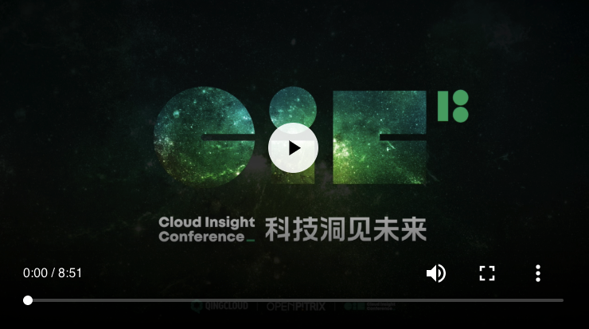

# OpenPitrix资料精选

*OpenPitrix = Open Source + PaaS + IaaS + Matrix*

- 视频: https://openpitrix.pek3a.qingstor.com/video/OpenPitrix_min.mp4
- 提示: 请在浏览器中查看视频!

## 官方文档

- https://openpitrix.io
- https://docs.openpitrix.io/home

## 技术文章

- [OpenPitrix 洞见](https://github.com/openpitrix/openpitrix/wiki/OpenPitrix-%E6%B4%9E%E8%A7%81)
- [OpenPitrix Insight](https://github.com/openpitrix/openpitrix/wiki/OpenPitrix-Insight)
- [企业多云应用管理平台痛点剖析及架构设计实践](https://mp.weixin.qq.com/s/1CwErUp2EWVR_WQMtQPF4A) - 含视频
- [如何跨云实现应用部署管理](https://mp.weixin.qq.com/s/90hmcvcS1cpBPrRjKer79A) - 含视频
- [探秘 OpenPitrix 多云应用管理平台架构实践](https://zhuanlan.zhihu.com/p/47084690)

**幻灯片**

- [《多云应用管理平台架构设计》](https://myslide.cn/slides/8822)

## 媒体文章

- [青云QingCloud出席源创会 解读OpenPitrix微服务](https://log.qingcloud.com/archives/3480)
- [云计算进入多云时代 青云QingCloud如何帮企业做好多云管理？](https://t.cj.sina.com.cn/articles/view/2286037382/8842298602000bwy7)
- [从资源到应用青云QingCloud帮助企业应对多云管理挑战](http://cloud.idcquan.com/yzx/148726.shtml)
- [青云QingCloud开启多云管理时代的两把钥匙](http://cloud.zol.com.cn/694/6946010.html)
- [OpenPitrix、RadonDB 亮相 QCon 全球软件开发大会 青云QingCloud 秀出开源实力](http://www.ijiandao.com/2b/baijia/111380.html)
- [九大品牌发布，你对青云的认识又该刷新了](http://www.dostor.com/p/51816.html)

## 职位招聘

- https://www.zhipin.com/job_detail/75b2ea1b436937e91XJ73d-_EFc~.html
- https://www.lagou.com/jobs/5094324.html
